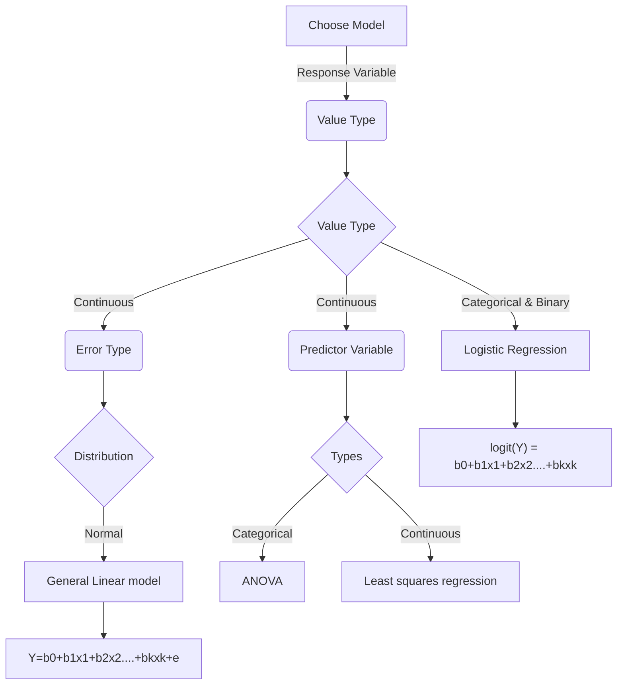

### Statistical modeling

#### Basics
- Types of Variables
  - Response variables
    - Outcome, target or dependent variables
    - Variables that you seek to predict
  - Predictor variables
    - input, explanatory or independent variables
    - Used to predict the value of response variables
- Variable values can be
  - Continuous
    - Numerical value
  - Categorical
    - Non numeric values Ex: On, off
  - Ordinal
    - Similar to categorical but have a heirarchy Ex: low, medium, high
- Types of Models
  - General linear model
  - logistic regression
- Logic for choosing the models

  
